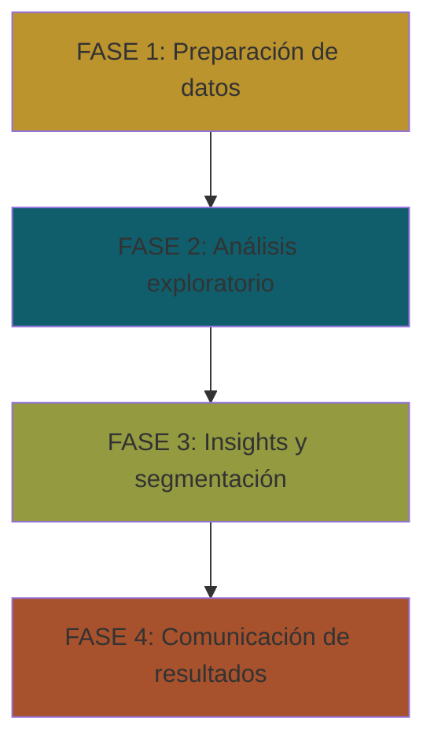

# Análisis de Ventas de Productos Digitales

## Descripción del Proyecto

Este proyecto analiza patrones de consumo en el mercado de productos digitales mediante un dataset simulado de 8,000 registros de órdenes de compra, abarcando los últimos 12 meses. El análisis se enfoca en identificar oportunidades estratégicas para mejorar la rentabilidad y retención de clientes en la venta de ebooks, cursos online, plantillas y música/licencias.

## Objetivos

- Identificar las categorías más rentables (ventas vs ingresos)
- Analizar tendencias de compra por mes y temporada
- Calcular ticket promedio y variación entre categorías
- Diferenciar el comportamiento de clientes recurrentes vs nuevos
- Proponer estrategias de retención y crecimiento

## Dataset

- **Tamaño:** 8,000 registros de órdenes
- **Periodo:** Últimos 12 meses (con estacionalidad en Ene, Sep, Nov, Dic)
- **Variables:** 20 variables principales

### Variables Principales

| Variable | Descripción |
|----------|-------------|
| `order_id` | Identificador único de la orden |
| `customer_id` | Identificador del cliente |
| `product_name` | Nombre genérico del producto |
| `category` | Tipo de producto (Ebook, Curso, Plantilla, Música) |
| `price_usd` | Precio unitario en USD |
| `quantity` | Cantidad de unidades compradas |
| `discount_rate` | Tasa de descuento aplicada (0-15%) |
| `gross_amount_usd` | Ingreso bruto (precio × cantidad) |
| `net_revenue_usd` | Ingreso neto tras descuento |
| `purchase_dt` | Fecha/hora de la compra |
| `region` | Región de compra (NA, EU, LATAM, ASIA, OTHER) |
| `channel` | Canal de adquisición (Website, Marketplace, Email, SocialAds) |
| `payment_method` | Método de pago (Card, PayPal, Stripe, Crypto) |

## Preguntas de Investigación

1. ¿Qué patrones de consumo caracterizan a los compradores de productos digitales?
2. ¿Qué categorías muestran mayor rentabilidad y estabilidad de ventas?
3. ¿Existen diferencias significativas en el comportamiento de compra según el canal?
4. ¿Cómo influye la estacionalidad en las ventas y los ingresos netos?
5. ¿Qué oportunidades estratégicas pueden derivarse de estos patrones?

## Estructura del Proyecto

El análisis se desarrolla en 4 fases principales:

### Fase 1: Preparación de Datos 

**Objetivo:** Garantizar la calidad y estructura del dataset

1. Carga de datos e importación de librerías
2. Validaciones básicas (estructura, tipos, valores faltantes)
3. Limpieza (duplicados, outliers, inconsistencias)
4. Enriquecimiento temporal (mes, trimestre, día de semana, temporada)

### Fase 2: Análisis Exploratorio 

**Objetivo:** Comprender el comportamiento general del negocio

#### 1. KPIs Globales

| KPI | Valor |
|-----|-------|
| Ingresos Netos Totales | $374,647.04 |
| Ingresos Brutos Totales | $379,572.66 |
| Total de Unidades Vendidas | 9,664 |
| Valor Promedio de Pedido | $46.83 |
| Valor Máximo de Pedido | $236.28 |
| Valor Mínimo de Pedido | $2.55 |
| Tasa de Descuento Promedio | 1.29% |

#### 2. Hallazgos por Dimensiones

**Categorías:**
- Los **ebooks** son la categoría con mayor volumen de ventas
- Los **cursos** generan la mayor parte de los ingresos netos

**Temporalidad:**
- Pico de ventas en **Enero 2025**

**Comportamiento de compra:**
- La mayoría de compras se realizan con **tarjeta**
- El **sitio web** es el canal principal
- Gran proporción de región "desconocido" (oportunidad de mejora en captura de datos)

#### 3. Análisis de Clientes

| Métrica | Valor |
|---------|-------|
| Total de Clientes Únicos | 995 |
| Clientes con más de una compra | 441 (44.3%) |
| Clientes con una sola compra | 554 (55.7%) |
| Cliente que más ha gastado | ID:1 ($88,350.46) |
| Cliente que menos ha gastado | ID:12 ($2.85) |
| % de ingresos del top cliente | 23.58% |

### Fase 3: Insights y Segmentación 

**Objetivo:** Profundizar en patrones específicos

1. Segmentación simple por valor, frecuencia y preferencias
2. Hallazgos y recomendaciones estratégicas

*En desarrollo*

### Fase 4: Comunicación de Resultados 

**Objetivo:** Presentar resultados de forma clara y accionable

1. Visualizaciones clave
2. Diseño de dashboard interactivo

*Planificado*

## Contacto 
Si te interesó el proyecto puedes escribirme al email: [nbaezhuber@gmail.com](mailto:nbaezhuber@gmail.com)