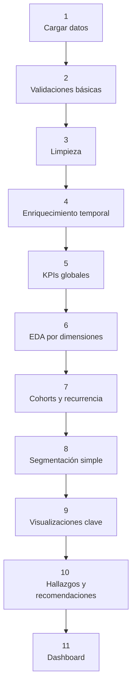

# Análisis de ventas de productos digitales simuladas

Este proyecto busca analizar patrones de consumo en el mercado de productos digitales (ebooks, cursos online, plantillas, música/licencias) mediante un dataset simulado. 

## Objetivo del proyecto

Identificar:

- Categorías más rentables (ventas vs ingresos).
- Tendencias de compra por mes/temporada.
- Ticket promedio y variación entre categorías.
- Clientes recurrentes vs nuevos.
- Posibles estrategias de retención y crecimiento.

# Dataset 
**Tamaño:** 8,000 registros de órdenes de compra.

**Periodo:** últimos 12 meses (con estacionalidad realista en Ene, Sep, Nov, Dic).

**Unidades de análisis:** cada fila corresponde a una orden (producto comprado por un cliente en una fecha).

**Variables principales:**
- `order_id` → identificador único de la orden.
- `customer_id` → identificador del cliente.
- `product_name` → nombre genérico.
- `category` → tipo de producto digital (Ebook, Curso, Plantilla, Musica).
- `price_usd` → precio unitario en USD.
- `quantity` → cantidad de unidades compradas.
- `discount_rate` → tasa de descuento aplicada (0–15%).
- `gross_amount_usd` → ingreso bruto (precio x cantidad).
- `net_revenue_usd` → ingreso neto tras descuento.
- `purchase_dt` → fecha/hora de la compra.
- `region` → región de compra (NA, EU, LATAM, ASIA, OTHER).
- `channel` → canal de adquisición (Website, Marketplace, Email, SocialAds).
- `payment_method` → método de pago (Card, PayPal, Stripe, Crypto).

## Esquema del proyecto 
